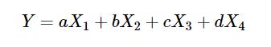
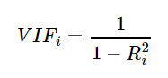
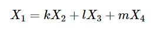

# 공선성 (Collinearity)

*공선성*이란 하나의 입력(독립)변수가 다른 입력변수와 강한 상관관계가 존재하는 상태이다.  
하지만 보통 여러가지의 독립변수들이 하나의 종속변수와 상관관계가 있다고 보고 분석하므로,  
_다중공선성(MultiCollinearity)_ 을 알아보자. 사실 두가지는 같은 단어로 쓰인다.  

## 다중공선성(Multicollierity)

다중공선성이란 하나의 독립변수가 다른 여러개의 독립변수와 강한 상관관계가 존재하는 상태를 말한다.  
즉 쉽게말해 아래와 같은 식이 존재할 때,  
  
`x_1, x_2, x_3, x_4`가 서로 상관관계에 있어, 영향을 끼치는 상태를 말한다.  
결국 서로 다른 독립변수들이 서로에게 영향을 받으므로, 회귀계수`(a, b, c, d)`를 추정하기 어렵다.  

## 다중공선성의 검사  

다중공선성을 검사하는 방법에는 여러가지가 있다. 여기서는 간단히 소개만 하고, `VIF`에 대해 알아보자.  
VIF, 상관행렬, 공차한계, 상태지수 등의 방법이 있다.  

### VIF(Variation Inflation Factor, 분산팽창지수)
대표적으로 `VIF`식이 많이 사용된다.  
분산팽창지수란 다른 변수들의 선형 결합으로 해당 변수를 설명할 수 있는 정도이다.  
  

위 식에서 `R`값은 각 독립변수 하나를 종속변수로 두고 나머지 독립변수로 표현했을 때의 결정계수이다.  
  

일반적으로 `VIF`값이 10이상일 경우 해당 변수가 다중공선성이 있다고 판단하지만 개인마다 다르다.  

## 다중공선성 문제의 해결
다중공선성 문제가 있다면 회귀값이 예측값의 정확도가 하락하기 때문에 문제를 해결해야 한다.  

- 변수를 제거한다.  
   VIF 값이 높은 변수들중 유의미하다고 생각되는 변수들은 남기고 나머지는 제거한다.  
   이 때, 유의미한 변수를 찾는 방법은 다양하게 있다.  
- 주성분 분석
   여러가지 변수 중 주성분 분석을 통해 주성분 변수를 찾아내어 이들로 종속변수를 설명하는 모델을 만든다.  
- 능형 회귀분석
   `MSE`를 최소화 하는 바이어스된 추정량을 사용

[보스턴 집값으로 알아보는 예제](https://datascienceschool.net/view-notebook/36176e580d124612a376cf29872cd2f0/) 
